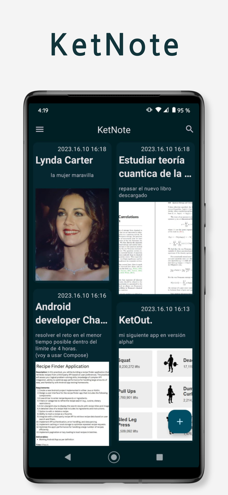

# KetNote

Es una simple Todo-App en donde puedes guardar,editar y eliminar tus notas favoritas.
ademas de poder agregar una imagen si asi lo deseas.

Detalles de la app:

-Usa la api de google auth para iniciar sesion en Mongo y en Firebase.
-Guarda las notas en Mongo Realm la cual nos permite comunicacion en tiempo real
para recuperar cambios en la base de datos no relacional asi como tambien guardar
de forma local en el dispositivo mientras que las imagenes son guardadas en Firebase Storage.
-Soporta el modo offline-first, de forma nativa mongo guarda las notas en el dispositivo y sincroniza automaticamente
los cambios tanto del telefono como de la base de datos una vez que recupera la conexion,
para las imagenes uso Room para guardar las uris de forma local y encuanto recupero la conexion
subo inmediatamente a firebase y actualizo las notas, del mismo modo el sistema de eliminado de imagen.
-la app usa las mas recientes bibliotecas de jetpack components como son Room,Hilt,Material 3, Navigation component, View Binding,
-usa bibliotecas y apis de terceros tales como Glide,Mongo Realm,Firebase(auth,storage,crashlitics)

Objetivos:

Con esta app escrita en el viejo sistema de vistas y xml, quisiera poder demostrar el uso de clean architecture 
y el patron de presentacion MVVM+ el cual consiste en añadir elementos de MVI como clases que guardan estado al view model.

Del mismo modo la destreza en el uso del viejo sistema de vistas para crear una applicacion moderna utilizando views y xml.

