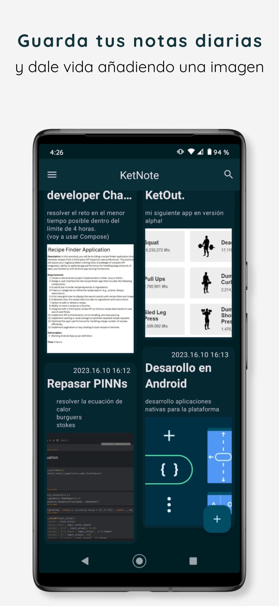
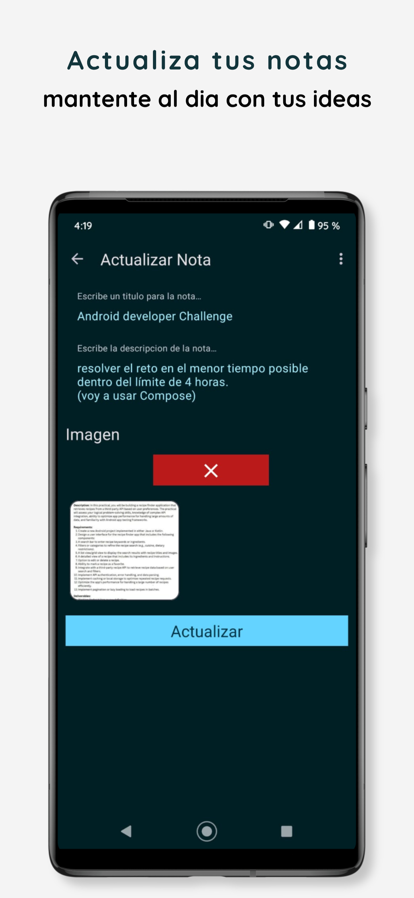
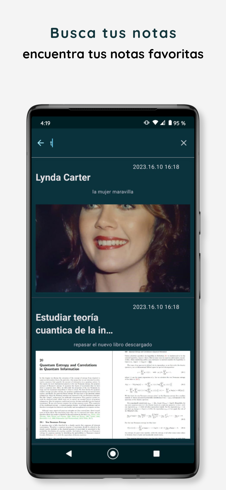
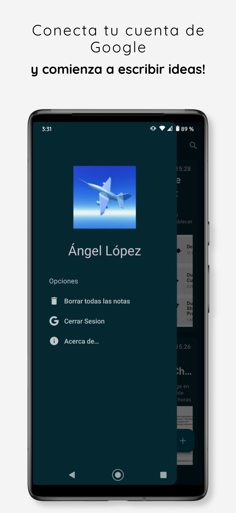

# KetNote

It is a simple Todo-App where you can save, edit and delete your favorite notes. In addition to being able to add an image if you wish.

App details:

-Use the Google Auth API to log into Mongo and Firebase. -Saves the notes in Mongo Realm which allows us real-time communication to recover changes in the non-relational database as well as save locally on the device while the images are saved in Firebase Storage. -Supports offline-first mode, mongo natively saves the notes on the device and automatically synchronizes the changes from both the phone and the database once the connection is recovered, for images I use Room to save the uris automatically local and as soon as I recover the connection I immediately upload to firebase and update the notes, in the same way the image deleted system. -the app uses the latest jetpack component libraries such as Room,Hilt,Material 3, Navigation component, View Binding, -uses third-party libraries and apis such as Glide,Mongo Realm,Firebase(auth,storage,crashlytics)

Goals:

With this app written in the old views and xml system, I would like to be able to demonstrate the use of clean architecture and the MVVM+ presentation pattern which consists of adding MVI elements as classes that save state to the view model Likewise, the skill in using the old views system to create a modern application using views and xml.

